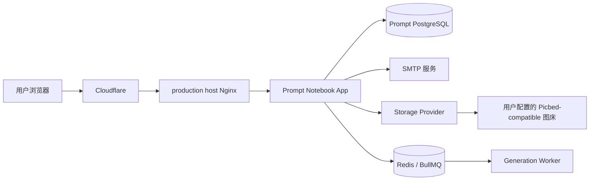
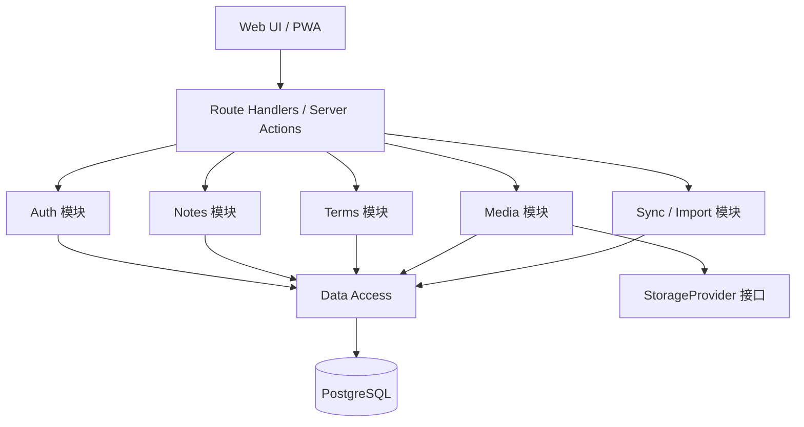
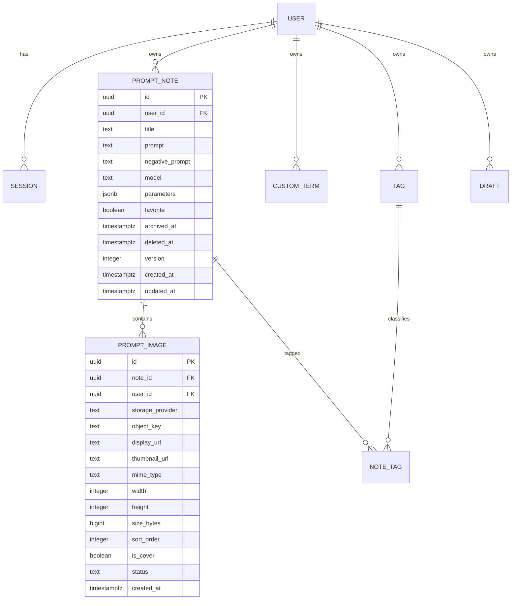
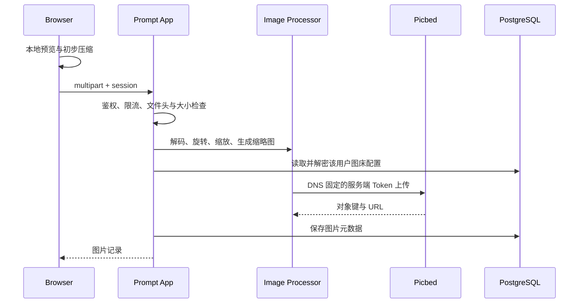

# Prompt Notebook 系统架构

状态：已确认
日期：2026-07-19

## 1. 架构摘要

系统采用模块化单体：Next.js 应用提供响应式 Web UI、同源 API 和认证入口；PostgreSQL 保存账户、笔记及加密配置；Redis/BullMQ 与独立 worker 执行持久化生图任务；图片通过可替换存储适配器写入用户配置的 Picbed-compatible 图床。

生产环境由任意 HTTPS 反向代理将用户域名转发到仅监听回环地址的应用容器。WordPress 不参与认证、数据或部署。

## 2. 功能需求

- 游客本地使用与注册用户云端同步。
- 邮箱密码注册、验证、登录、密码重置和会话管理。
- 笔记、自定义词条、标签、草稿和图片的完整生命周期。
- 图片上传、缩略图、封面、排序和失败重试。
- 搜索、筛选、收藏、归档、回收站、导入和导出。
- 桌面与移动端一致的数据能力和适配交互。

## 3. 非功能需求

| 类别 | MVP 目标 |
|---|---|
| 首屏 | 移动 4G LCP <= 2.5s，常规宽带 <= 1.5s |
| 交互 | 本地反馈 <= 100ms；普通 API p95 <= 300ms |
| 可用性 | 99.9% 月度可用性目标 |
| 数据恢复 | 数据库 RPO <= 1h，RTO <= 4h |
| 容量 | 首期 1,000 用户、每用户 10,000 笔记可平滑运行 |
| 安全 | TLS、HttpOnly 会话、用户级授权、上传校验、限流 |
| 可移植性 | 标准 Docker Compose；不强依赖 WordPress、R2 或 SaaS |
| 可访问性 | 核心流程达到 WCAG 2.2 AA |

这些是工程目标而非当前服务等级协议；上线后用真实监控数据校准。

## 4. 系统上下文



## 5. 应用模块



模块之间通过显式服务接口交互，不允许 UI 直接访问数据库、模型 Key 或图床 Token。Web 与 generation worker 共享 PostgreSQL 和 Redis 队列，但账户会话与领域数据仍以 PostgreSQL 为准。

## 6. 技术栈

| 层 | 选择 | 说明 |
|---|---|---|
| Web | Next.js App Router、React、TypeScript | 同仓提供 UI、API 和认证，支持 Docker 自托管 |
| 样式 | Tailwind CSS + CSS variables + Radix primitives | 保留独特视觉，同时复用可靠交互原语 |
| 表单与校验 | React Hook Form、Zod | 客户端体验与服务端边界使用同一模式 |
| 数据 | PostgreSQL 16、Drizzle ORM | 独立持久化、事务、索引和可迁移模式 |
| 认证 | Better Auth | 自托管邮箱密码、验证、重置和会话管理 |
| 本地存储 | IndexedDB | 游客数据、草稿、离线队列和上传恢复 |
| 图像处理 | Sharp（服务端） | 解码验证、尺寸限制、方向修正和衍生图 |
| 测试 | Vitest、Testing Library、Playwright | 单元、组件、API 和跨设备端到端测试 |
| 部署 | Docker Compose、Nginx、Cloudflare | 与当前服务器形态一致，部署简单 |

## 7. 数据模型



所有用户数据表都含 `user_id`。服务端查询必须同时限定资源 ID 和当前会话用户 ID；数据库迁移应提供约束、外键和必要索引。

建议索引：

- `prompt_notes(user_id, updated_at desc)`
- `prompt_notes(user_id, favorite, updated_at desc)`
- `prompt_notes(user_id, deleted_at, archived_at)`
- 标题与 Prompt 的 `pg_trgm` GIN 索引
- `prompt_images(note_id, sort_order)`
- `custom_terms(user_id, category, label)`

## 8. API 边界

公开 API 以 `/api/v1` 版本化：

| 方法 | 路径 | 用途 |
|---|---|---|
| GET/POST | `/notes` | 分页查询、新建笔记 |
| GET/PATCH/DELETE | `/notes/:id` | 详情、修改、移入回收站 |
| POST | `/notes/:id/restore` | 从回收站恢复 |
| GET/POST | `/terms` | 查询、新建自定义词条 |
| POST | `/terms/analyze` | 使用用户文本模型生成经校验的词条候选 |
| POST | `/terms/bulk` | 去重后批量保存用户确认的候选词条 |
| PATCH/DELETE | `/terms/:id` | 修改、删除自定义词条 |
| POST | `/uploads` | MVP 服务端代理上传 |
| POST | `/uploads/presign` | 第二阶段签名直传 |
| POST | `/sync/import-preview` | 解析并预览旧数据 |
| POST | `/sync/import` | 幂等合并导入 |
| GET | `/export` | 导出用户数据 |

所有写操作使用 Zod 校验、统一错误格式和请求 ID。更新笔记必须提交 `version`；SQL 更新条件包含旧版本号，未命中时返回 `409 Conflict`。

## 9. 认证与授权

- Better Auth 使用同源、`HttpOnly`、`Secure`、合适 `SameSite` 的会话 Cookie。
- 默认邮箱密码；生产要求邮箱验证，提供忘记密码和会话撤销。
- 登录、注册、重置和上传端点采用分层限流：Cloudflare/Nginx 粗粒度，应用按用户或 IP 细粒度。
- 不接受客户端提供的 `user_id` 作为授权依据。
- 管理功能若未来需要，使用显式角色；MVP 普通用户之间完全隔离。
- 账户删除进入延迟任务：撤销会话、删除数据库数据、排队清理对象存储。

## 10. 本地优先与同步

IndexedDB 保存本地实体、草稿和操作队列。服务端数据库仍是登录用户的最终事实来源。

写入流程：

1. 生成客户端 UUID 和幂等键。
2. 立即写 IndexedDB 并更新 UI。
3. 将操作加入 outbox。
4. 在线时发送 API；成功后记录服务端版本和时间。
5. 网络失败保留队列并指数退避。
6. `409` 时停止自动覆盖，显示冲突比较。

游客登录迁移必须先生成预览：新增、重复、冲突、跳过和失败数量。合并操作使用幂等键，重复提交不会生成重复笔记。

## 11. 图片存储

定义 `StorageProvider`：

```ts
export interface StorageProvider {
  upload(input: { data: Buffer; filename: string; mimeType: string; path: string }): Promise<StoredImage>;
}
```

首个实现为 `PicbedProvider`。每位用户在设置页填写自己的 HTTPS 上传端点和 Token；Token 以 AES-256-GCM 加密保存在 PostgreSQL，只在一次服务端上传期间解密，并通过 `X-Auth-Token` 发送。

MVP 上传链路：



后续若图床支持签名上传，则浏览器直传；App 只签发短期、单对象、限定 MIME 和大小的凭证。现有公开 URL 不等同于私有图片，正式多用户上线前必须决定使用私有对象加签名读取，或明确告知公开 URL 风险。

## 12. 性能策略

- Cloudflare 缓存版本化静态资源，不缓存认证 API 或私人页面响应。
- 作品库采用游标分页和固定比例缩略图，避免布局跳动。
- 图片使用懒加载、响应式尺寸和 CDN 长缓存。
- 编辑器代码与词库按路由或面板懒加载。
- 数据库查询只选择列表需要字段，避免加载完整 Prompt 和全部图片。
- 搜索初期使用 PostgreSQL 索引；没有数据证明前不引入 Elasticsearch。
- 自动保存使用本地即时写入与服务端 600-1000ms 防抖。

## 13. 安全

- TLS 终止于 Nginx；应用容器只监听 `127.0.0.1` 或内部网络。
- 配置 CSP、HSTS、`X-Content-Type-Options`、`Referrer-Policy` 和权限策略。
- 上传验证魔数、MIME、扩展名、解码结果、像素数和尺寸；拒绝 SVG。
- 限制请求体、并发上传和用户配额。
- HTML 内容按纯文本保存和渲染，不支持任意 HTML。
- 日志不记录密码、会话、Token 或完整私人 Prompt。
- 依赖锁定、自动依赖扫描、密钥仅在服务器和 CI Secret 中保存。

## 14. 备份与恢复

- PostgreSQL 每小时逻辑或增量备份，至少每日一份异机/对象存储副本。
- 保留 7 个每日、4 个每周、3 个每月备份，具体期限上线前确认。
- 每月进行恢复演练并记录恢复时间。
- 数据库备份保存图片对象键；图床使用版本、生命周期或独立备份策略。
- 发布前执行迁移备份；迁移需向前兼容并提供恢复说明。

## 15. 可观测性

- `/health/live` 检查进程，`/health/ready` 检查数据库与必要配置。
- 结构化 JSON 日志包含 request ID、路由、状态、耗时和匿名用户 ID。
- 指标：请求 p95、错误率、登录失败、同步积压、上传成功率、数据库连接和磁盘。
- 外部探测 `prompts.example.com`；关键错误告警但避免每个客户端失败都触发通知。

## 16. 部署

```text
HTTPS proxy -> 127.0.0.1:<app-port> -> prompt-app -> prompt-postgres
                                             |----> prompt-redis -> generation-worker
                                             `----> user-configured image host
```

- Release 工作流构建版本镜像；自托管更新器也可按固定 commit SHA 在服务器构建。
- 服务器使用独立 Compose 项目和专用数据库卷，不复用 WordPress 或 AI Hub 数据库。
- 部署顺序：备份、拉镜像、运行迁移、启动新容器、健康检查、切换流量。
- 保留前一个可运行镜像，应用失败可回滚；数据库迁移优先采用 expand/contract。

## 17. 失败模式

| 故障 | 用户影响 | 缓解 |
|---|---|---|
| 数据库不可用 | 云端读写失败 | 本地草稿与 outbox 保留，恢复后重试 |
| 图床不可用 | 图片不能完成上传 | 笔记先保存，图片单独重试 |
| SMTP 不可用 | 新验证与重置邮件延迟 | 明确状态、队列或重试、监控 |
| 多设备冲突 | 可能覆盖内容 | 乐观锁、409、人工选择或复制版本 |
| 新版本资源错位 | 页面导航异常 | 固定部署 ID、版本化资源、必要时整页刷新 |
| 磁盘空间不足 | 数据库或容器故障 | 磁盘告警、备份轮转、图片不落本机 |
| 图床对象已删 | 卡片破图 | 占位图、对象核查、重新上传 |
| 客户端导入恶意文件 | 解析或资源耗尽 | 大小限制、模式校验、批次事务和预览 |

## 18. 开源边界

- 所有域名、SMTP、数据库、认证密钥和存储实现通过环境变量配置。
- 提供 `local`、`s3-compatible` 和 `picbed` 存储驱动。
- 内置词库以公开 JSON seed 发布；用户数据不进入仓库。
- 默认 Compose 可在单机运行，不要求 Cloudflare、Nginx 或 WordPress。
- 文档包含安装、升级、备份、恢复、隐私和存储适配说明。

## 19. ADR 索引

- [ADR-0001：采用 Next.js 模块化单体](adr/0001-modular-monolith-nextjs.md)
- [ADR-0002：采用独立 PostgreSQL](adr/0002-postgresql-system-of-record.md)
- [ADR-0003：采用 Better Auth](adr/0003-better-auth.md)
- [ADR-0004：使用可替换图片存储适配器](adr/0004-storage-provider.md)
- [ADR-0005：采用本地优先草稿与同步 outbox](adr/0005-local-first-sync.md)
- [ADR-0006：采用 Docker Compose 自托管](adr/0006-self-hosted-deployment.md)
