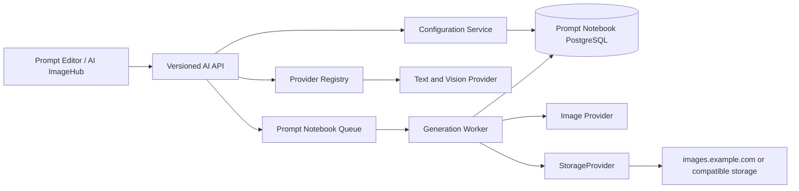

# Prompt Notebook AI Core Integration Design

Status: Approved direction
Date: 2026-07-22

## 1. Goal

Prompt Notebook will own its AI configuration, prompt optimization, reverse-prompt, and image-generation capabilities. ACKS Image Web remains an implementation reference only. The products will not share authentication, databases, encryption keys, queues, or runtime state.

The user journey is continuous: write or open a prompt, optimize it without losing the original, test it in AI ImageHub, then attach a successful image to the same note.

## 2. Product requirements

- Keep the current responsive notebook design language.
- Let each signed-in user persist multiple AI configurations across devices.
- Select separate active models for prompt optimization, image generation, and image understanding.
- Never replace editor content until the user explicitly accepts an AI result.
- Run long image jobs outside the web request lifecycle and recover their status after refresh or restart.
- Store generated images through the existing storage provider; production must not fall back to local disk.
- Keep the project self-hostable without WordPress or ACKS Image Web.

## 3. Scope

### Phase A

- Encrypted user-owned provider connections.
- Model profiles with declared capabilities.
- Per-purpose active model preferences.
- OpenAI-compatible provider adapter.
- Connection and capability checks.
- AI assistant configuration page.

### Phase B

- General prompt optimizer in create and edit flows.
- Image-specific optimizer in AI ImageHub.
- Original/result comparison, accept, discard, copy, cancel, and undo.

### Phase C and D

- Durable image-generation jobs, isolated queue, worker, retries, cancellation, and history.
- Text-to-image, image-to-image, reference images, reverse prompting, and note attachment.

## 4. Architecture



The Next.js application remains a modular monolith. AI configuration and short text/vision calls stay in the web application. Long image generation runs in a dedicated worker. The worker and web application communicate through durable job state and an isolated queue.

## 5. Data model

### `ai_provider_connections`

One encrypted connection owned by one user. It stores a user-facing name, adapter type, HTTPS base URL, encrypted secret, key identifier, masked hint, enabled state, and last test result. Every lookup includes `user_id`.

### `ai_model_profiles`

A model exposed through a provider connection. It stores the remote model identifier, display name, declared capabilities, bounded defaults, and enabled state. The unique key is owner plus connection plus remote model ID.

### `ai_model_preferences`

One row per user and purpose points to the active prompt-optimization, image-generation, or vision/reverse-prompt profile. A composite foreign key enforces same-owner assignment, and service-layer validation ensures the selected profile declares the required capability.

### Later generation tables

`ai_generation_jobs` stores durable status and bounded parameters. `ai_generation_assets` stores object references, never long-lived base64 payloads. Temporary and retained objects use separate storage prefixes.

## 6. Credential protection

- Encrypt secrets with AES-256-GCM using a random 96-bit IV.
- Bind ciphertext to the owner, connection ID, provider type, and key version with authenticated additional data.
- Load a versioned key ring from server-only configuration and designate one active key for new writes.
- Never return ciphertext, IV, authentication tag, or plaintext to clients.
- Show only a non-secret masked hint.
- Exclude secrets from account export and logs.
- Support key rotation by decrypting with the stored version and rewriting with the active version.

## 7. Provider boundary

The first adapter is OpenAI-compatible. It supports capability-specific operations rather than exposing arbitrary upstream HTTP:

```ts
interface AiProviderAdapter {
  testConnection(input: ConnectionInput): Promise<ConnectionTestResult>;
  optimizePrompt(input: PromptOptimizationInput): Promise<string>;
  reversePrompt(input: ReversePromptInput): Promise<string>;
  generateImage(input: ImageGenerationInput): Promise<GeneratedImage>;
}
```

Custom base URLs are server-side outbound destinations and therefore an SSRF boundary. Only HTTPS is accepted. Credentials, fragments, non-default embedded ports, localhost names, private/link-local addresses, and unsafe redirects are rejected. DNS is checked again immediately before each outbound request.

## 8. UX rules

- Missing configuration links to `/settings/ai` and preserves a return URL.
- Configuration cards show purpose badges, capability badges, masked key status, and the last test result.
- Connection tests and real capability tests are distinct because some compatible relays do not expose `/models`.
- An optimizer request snapshots the editor revision. A stale result cannot overwrite newer text.
- Loading uses a spinner and live status, never a fake percentage.
- Desktop shows original and candidate side by side; mobile uses tabs.
- Discard keeps the original byte-for-byte. Accept marks the editor dirty and offers one-step undo.

## 9. Failure and operational model

- Map upstream authentication, quota, rate-limit, unsupported capability, timeout, and malformed response failures to stable internal error codes.
- Apply per-user limits to optimization, reverse prompting, and generation.
- Do not log full prompts, images, upstream bodies, or secrets.
- Production image generation succeeds only after the storage provider confirms a readable object.
- A cancelled remote job may still complete upstream; the worker discards its result when local state is cancelled.
- Initial production worker concurrency is one on the current two-vCPU host.

## 10. Acceptance

- A user can save at least ten configurations and select different models for all three purposes.
- Cross-user reads, writes, tests, and preference assignment are denied.
- Stored API keys cannot be recovered through any API response or export.
- Prompt optimization never replaces the editor until explicit acceptance.
- Generated images do not persist on the application server.
- Refreshing the page or restarting the web container does not lose generation status.
