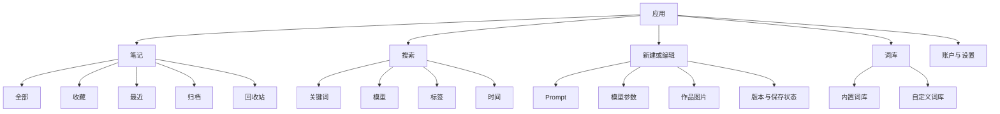

# Prompt Notebook 产品与交互设计

状态：已确认
日期：2026-07-19
目标域名：`https://prompts.example.com`

## 1. 产品定义

Prompt Notebook 是一个独立、跨设备、支持桌面与移动端的提示词作品库。它帮助用户完成四件事：快速记录提示词、关联生成作品、可靠保存与同步、快速查找并复用。

现有 `prompt-notebook.html` 仅作为视觉语言与需求验证 Demo，不作为新应用的代码或数据架构基础。

### 1.1 核心价值

> 记录提示词 -> 关联生成作品 -> 视觉化回看 -> 搜索与复用

### 1.2 目标用户

- 经常使用 Midjourney、SDXL、Flux、GPT Image 等工具的个人创作者。
- 需要整理提示词、模型参数和生成结果的设计师或内容创作者。
- 希望自行部署、不依赖 WordPress 或特定 SaaS 的开源用户。

### 1.3 MVP 目标

- 游客打开即用，注册后跨设备同步。
- 创建、修改、复制、收藏、归档和删除提示词笔记。
- 每条笔记支持生成图像预览，MVP 突出一张封面，数据结构支持多图。
- 按关键词、标签、模型、收藏和时间筛选。
- 自定义提示词词库，并在编辑器光标处快速插入。
- 自动保存、离线草稿、失败重试和可见同步状态。
- 可导入旧 Demo JSON，并可导出用户数据。

### 1.4 非目标

- MVP 不直接调用第三方模型生成图片。
- MVP 不做社区、关注、评论或公开作品广场。
- MVP 不做团队空间、复杂角色权限或付费订阅。
- MVP 不引入微服务、消息队列或专用搜索集群。
- MVP 不承诺多主实时协作编辑。

## 2. 设计原则

1. **内容先于装饰**：软木板与纸张语言用于建立个性，不牺牲可读性和密度。
2. **输入永不丢失**：输入先写本地，再同步服务端；错误必须可见且可恢复。
3. **视觉即索引**：有图片的笔记优先用作品封面帮助回忆，无图片时仍保持优秀的文字卡片。
4. **高频动作一步完成**：复制、收藏、新建、继续编辑不进入多层菜单。
5. **移动端重新编排**：不压缩桌面三栏，而是采用单列、底部导航和底部抽屉。
6. **开源可移植**：界面和流程不假设用户拥有 WordPress、Cloudflare 或指定图床。

## 3. 信息架构

## 4. 核心用户旅程

### 4.1 游客首次使用

1. 打开应用，直接看到少量示例和“新建 Prompt”。
2. 无需登录即可编辑，草稿即时写入 IndexedDB。
3. 游客可以保存本地笔记、搜索、复制和导出。
4. 当用户需要上传图片或跨设备同步时，界面解释登录收益，而不是强制中断创作。
5. 登录后显示本地数据迁移预览，用户确认后再合并云端数据。

### 4.2 新建提示词作品

1. 点击“新建”后立即聚焦正文输入框。
2. 输入标题、正文、负面词、模型和参数；标题允许稍后补充。
3. 从词库点击或键盘选择词条，在当前光标处插入。
4. 粘贴、拖放或选择生成图片，客户端立即显示本地预览。
5. 文本保存与图片上传相互独立；图片失败不会阻止笔记保存。
6. 保存后回到详情或作品库，封面出现在卡片上。

### 4.3 找回与复用

1. 从作品库通过封面、模型或标签识别目标。
2. 使用全局搜索匹配标题、Prompt、标签和模型。
3. 卡片快捷复制；详情页可以“复制为新笔记”，避免覆盖原作。
4. 修改原笔记时保留版本号，用于冲突检测和后续历史版本能力。

## 5. 桌面端布局

### 5.1 应用框架

- 左侧固定导航：全部、收藏、归档、回收站、标签、项目、变量模板、词库、ImageHub、分享管理和设置；AI 与图床配置不各占一个入口。
- 顶部工具栏：全局搜索、视图切换、同步状态、新建按钮和用户菜单。
- 中央区域：画廊或列表；宽屏编辑时采用编辑器与辅助面板分栏。
- 右侧辅助面板仅在编辑场景出现，承载词库、图片和元数据，不长期挤压作品库。

### 5.2 作品卡片

- 有图片：使用固定比例封面，避免瀑布流布局跳动。
- 无图片：使用有纸张质感的文字卡片和模型色签。
- 始终显示标题、模型、更新时间；Prompt 摘要和标签按空间渐进展示。
- 悬停操作：复制、收藏、更多。键盘聚焦时显示同样操作。
- 删除放入“更多”菜单，并进入回收站，不与复制并列。

### 5.3 编辑器

- 主编辑区保持稳定、无旋转、无强纹理。
- 标题、Prompt、负面词和参数使用清晰分组。
- 工具栏提供复制、撤销、保存状态和预览。
- 词库支持分类、搜索、键盘导航、自定义词条编辑和删除。
- 词库分析工作台从完整 Prompt 中提取原文片段，按类别展示候选；用户选择、编辑后才能批量收录，重复项必须提示或禁用。
- 图片区支持拖放、粘贴、排序、设置封面、重试和移除。

## 6. 移动端布局

- 底部导航：笔记、搜索、新建、词库、我的。
- 作品库单列展示，图片比例保持稳定。
- 编辑器全屏，底部固定“复制”和“保存”；软键盘出现时不遮挡输入。
- 词库使用底部抽屉，插入词条后保持编辑器光标位置。
- 图片支持相册、相机、文件选择和剪贴板粘贴。
- 触控目标最小 44x44 CSS 像素；危险操作要求确认或提供撤销。

## 7. 视觉系统

### 7.1 可复用语言

- 背景：暖灰软木板色。
- 表面：米白纸张。
- 主文字：墨黑；次文字：暖灰。
- 强调：印章红。
- 分类标签：Dymo 黑底白字。
- 字体：标题用 Serif，正文用易读 Sans，参数与状态用 Mono。

### 7.2 使用边界

- 胶带、纸张旋转和硬阴影只用于标题、空状态或少量卡片变化。
- 表单、菜单、对话框和长文本不旋转。
- 不使用大尺寸纹理图片；优先 CSS 纹理或极小可缓存资源。
- 动效为 120-180ms，并尊重 `prefers-reduced-motion`。
- 颜色对比符合 WCAG 2.2 AA；状态不能只用颜色表达。

## 8. 状态与反馈

每个编辑页面必须明确显示以下状态之一：

- 已保存到本机
- 正在同步
- 已同步
- 离线，等待同步
- 同步失败，可重试
- 发现其他设备修改，需要选择版本

图片还需要：准备中、上传中、处理中、完成、失败、等待重试。

空状态应提供明确下一步，不只显示“暂无数据”。错误提示使用可恢复动作；成功提示不遮挡连续操作。

## 9. 搜索与组织

- MVP 搜索范围：标题、Prompt、负面词、标签和模型。
- 筛选：模型、标签、是否有图、收藏、归档、日期区间。
- 排序：最近修改、最近创建、标题。
- 内置词库存放于版本化 JSON；自定义词库归用户所有并同步。
- AI 词库分析只提供候选，不自动写入；服务端再次验证分类、原文归属、长度和重复项。
- 中文搜索初期使用标准化字符串与 PostgreSQL `pg_trgm` 模糊匹配，避免依赖外部搜索服务。

## 10. 图片规则

- MVP 界面最多上传 4 张，选择 1 张作为封面；数据模型不限制未来扩展。
- 接受 JPEG、PNG、WebP；是否支持 AVIF 由上线前的浏览器兼容测试决定。
- 单文件原始上限 20 MB，解码后限制像素总量，防止解压炸弹。
- 默认生成最大边 2048px 的展示图和约 640px 缩略图。
- 上传前先显示本地预览；服务器不持久保存临时文件。
- 删除笔记先进入回收站；对象存储清理延迟执行，避免误删。

## 11. 验收指标

- 用户输入后刷新页面，内容仍存在。
- 图床失败时笔记文本仍可保存。
- 移动端 360px 宽度无横向滚动，主要操作不被软键盘遮挡。
- 键盘用户可以完成新建、词库插入、保存和复制。
- 作品库 500 条笔记仍能流畅滚动和筛选。
- 页面操作在正常网络下有即时本地反馈。
- 旧 Demo JSON 可预览、合并、撤销，不会静默覆盖云端数据。
