# Prompt Notebook usability audit

Date: 2026-07-20  
Mode: combined UX and accessibility-risk audit  
Surfaces: desktop web app, mobile web app, account/device page, Chrome extension landing page

## User goal and accessibility target

The core goal is to capture a prompt, optionally attach artwork, find it again, and reuse it without losing work. The target is keyboard-operable, mobile-friendly behavior with truthful state communication and WCAG 2.2 AA-oriented contrast and semantics.

## Flow evidence

### 1. First visit — needs work

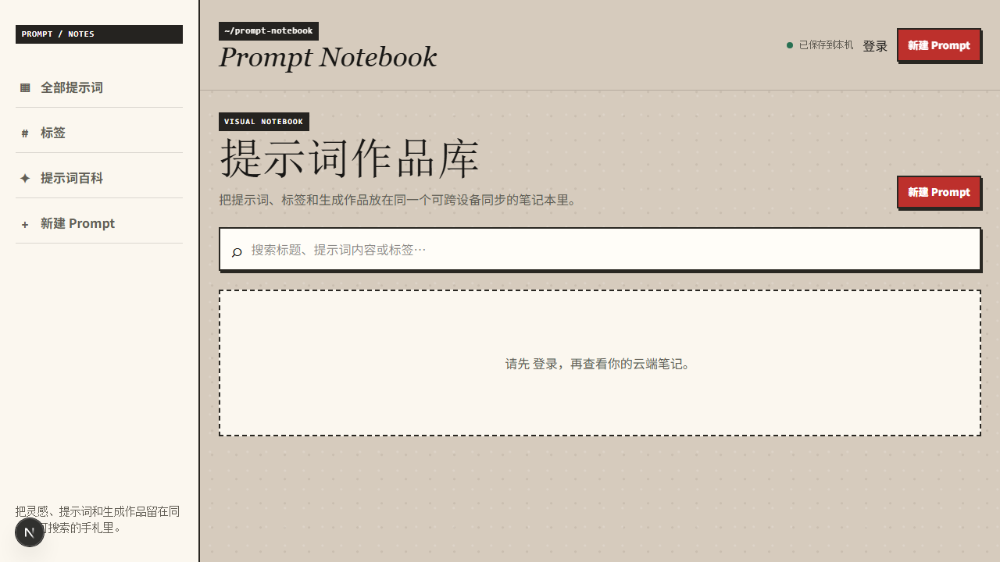

The visual hierarchy is distinctive and the search/gallery layout is immediately understandable. However, signed-out visitors see two “新建 Prompt” actions alongside a login wall, while the top status says “已保存到本机” even though no local persistence exists. The page does not explain whether visitors can try the product or must register.

### 2. Registration — healthy

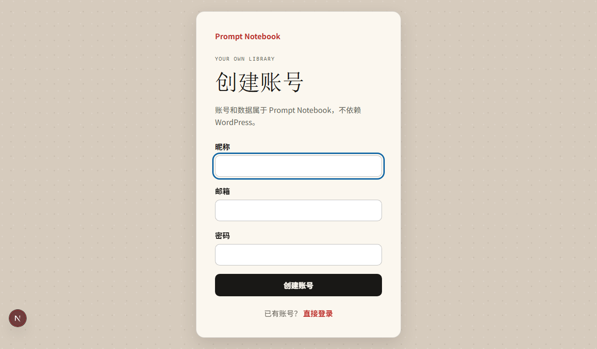

The form is focused, short, labeled, and keyboard friendly. The independent-from-WordPress message builds trust. Password requirements and the post-submit email-verification expectation should be stated before submission in production.

### 3. New prompt editor — usable but too long

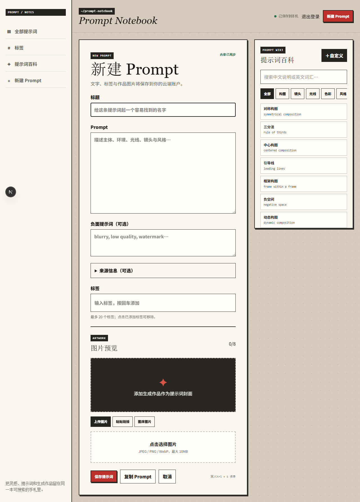

The two-column desktop editor makes the vocabulary useful without obscuring the prompt. The form is visually calm and labels are clear. The save status is incorrect on a new empty note, and primary actions are only at the bottom of a long form. The vocabulary briefly shows a false empty state before its request completes.

### 4. Gallery and search — healthy foundation

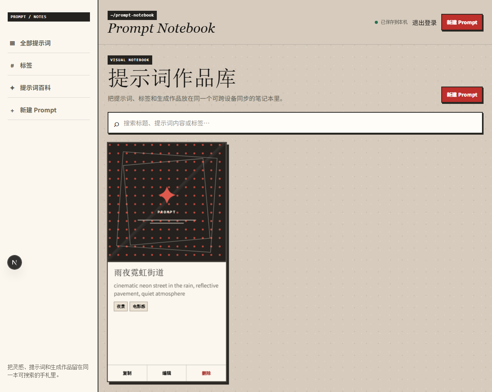

The fixed-ratio card, 150-character preview, tags, and explicit management actions are easy to scan. Missing organization controls—favorite, archive, trash, filters, and sort—will become the main friction as note counts grow.

### 5. Prompt preview — healthy

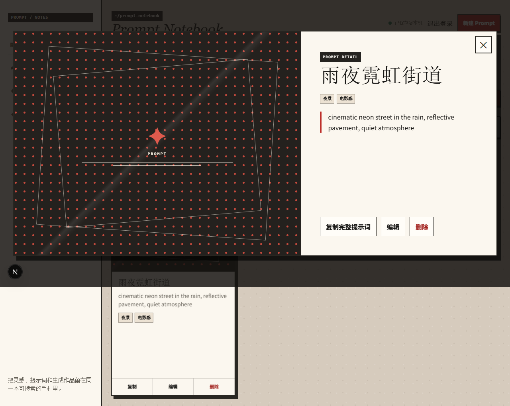

The dialog has strong hierarchy, a large artwork area, full prompt text, keyboard focus entry, focus trapping, and Escape handling. “复制为新笔记”, favorite, and archive actions are absent. Destructive delete is visually adjacent to common actions, though confirmation and undo reduce risk.

### 6. Mobile gallery — healthy with navigation pressure

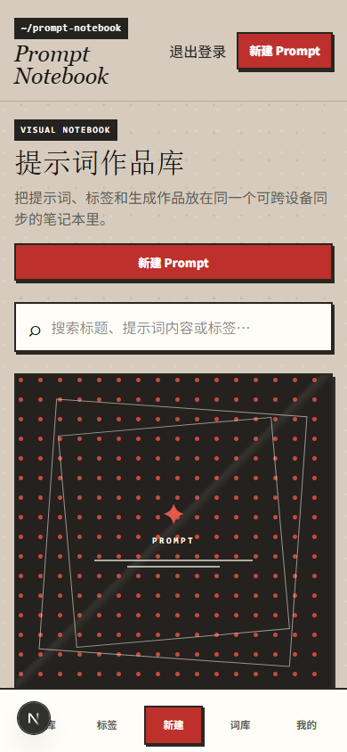

The single-column card and bottom navigation work at 390 px without horizontal overflow. The prominent duplicate create actions consume a large part of the first viewport. The fixed navigation should keep a reliable safe-area gap above card actions and editor buttons.

### 7. Mobile editor top — needs work

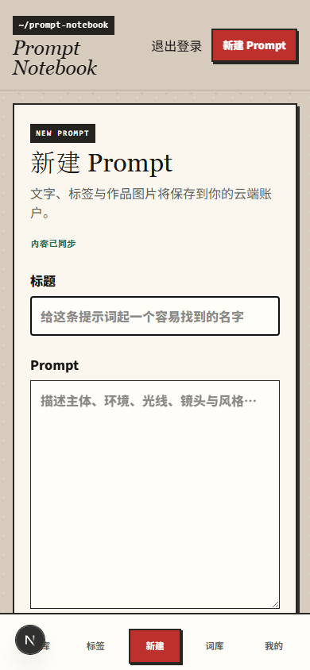

Fields reflow cleanly, but a user cannot see or reach save without a long scroll. The top says “内容已同步” before any note exists, which is a trust-breaking state error.

### 8. Mobile editor actions — needs work

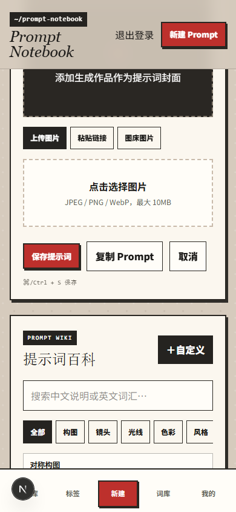

The bottom navigation competes with the save region and vocabulary. A sticky editor action bar above the mobile navigation, backed by local draft autosave, would shorten the perceived task and prevent accidental loss.

### 9. Extension distribution — healthy

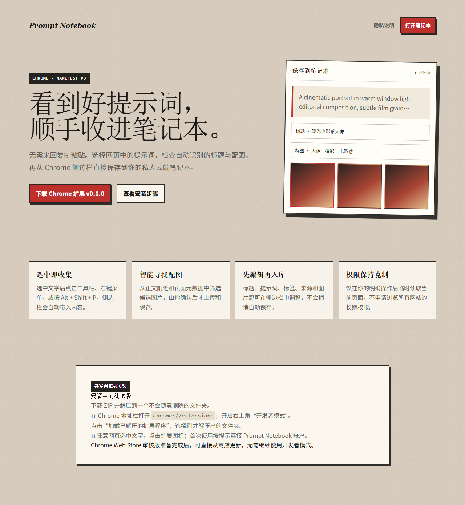

The promise, permissions posture, download, and developer-mode installation steps are clear. Chrome Web Store publication is intentionally outside this release. Self-hosted extension builds still need a configurable host permission.

## Highest-impact findings

1. Replace false “已保存到本机/内容已同步” states with real IndexedDB-backed draft states.
2. Remove the hydration mismatch caused by reading `window.location` in the initial React state.
3. Add favorite, archive, trash, filters, and sort before the gallery grows.
4. Put save access near the user on mobile and retain bottom safe-area spacing.
5. Provide import/export and a migration preview so data remains portable.
6. Turn the first signed-out view into a clear sign-in/register decision rather than a disabled notebook.

## Evidence limits

- Screenshots support visual and task-flow findings but do not establish full WCAG compliance.
- Keyboard behavior was inspected for the preview dialog and form controls; screen-reader output still needs automated and manual checks.
- The authenticated audit used an isolated local test account against the same code revision as production. The extension landing page was captured from production.
- Image-host failure and offline recovery require automated fault tests rather than screenshots alone.

## Post-implementation verification

The audit findings above describe the pre-change baseline. The implementation pass resolved the six highest-impact items:

1. IndexedDB now stores debounced, user-scoped editor drafts and offers explicit restore or discard after reload.
2. Sync labels distinguish cloud availability, unsaved changes, local draft persistence, and completed cloud saves.
3. Gallery state no longer reads browser URL state during hydration.
4. Favorite, archive, trash, restore, image filtering, and server-side title sorting are available from cards and previews.
5. Signed-out onboarding has one clear account action, while mobile uses one bottom create destination and a sticky editor save bar.
6. Versioned JSON export, preview-before-import, bounded parsing, cross-account ID remapping, and replay-safe import are available from the profile page.

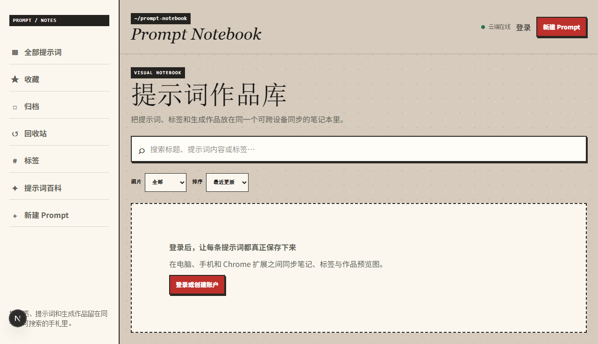

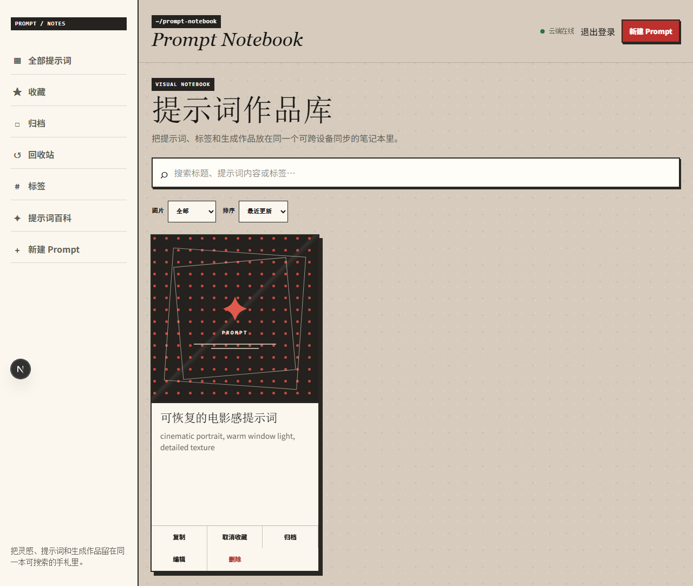

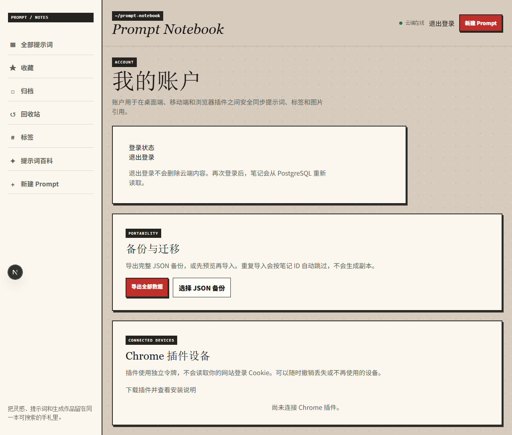

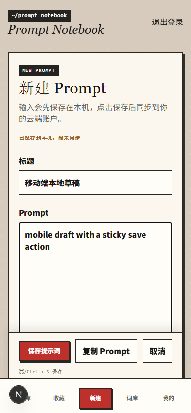

Automated verification covers organization state transitions, local draft recovery, authentication, import replay, PWA metadata, keyboard-reachable navigation, responsive overflow, and the existing image/extension flows. This reduces but does not replace manual screen-reader and restore-drill testing.
